# 1942 Pixel Campaigns Unified Design Doc

## Quick Navigation
- [Book](#book)
- [Mechanics](#mechanics)
- [Wave-by-Wave Visual Review](#wave-by-wave-visual-review)
- [Asset Gallery](#asset-gallery)
- [AI Art Pipeline](#ai-art-pipeline)

## Book

### Vision
`1942` is being rewritten as a high-fidelity pixel vertical shooter. This markdown is the single source for design, mechanics, pacing, and visual production review.

Goals:
- One canonical markdown file rendered into one browseable HTML page.
- All imagery follows top-down vertical shooter readability.
- Final-quality pixel look for planes, enemies, bosses, power-ups, terrain, and dialogue.
- Wave-by-wave previews so campaign pacing can be reviewed without playing.

### Core Systems
- 4 campaigns, 20 waves each.
- Waves 5/10/15: mini bosses.
- Wave 20: final boss.
- Inputs: `Space` fire, `X` special, `Shift` or double-`Space` roll, `B` bomb clear.
- HUD is single-player and top-aligned (`Score`, `Lives`, `Bombs`, `Wave`).

### Campaign Boards
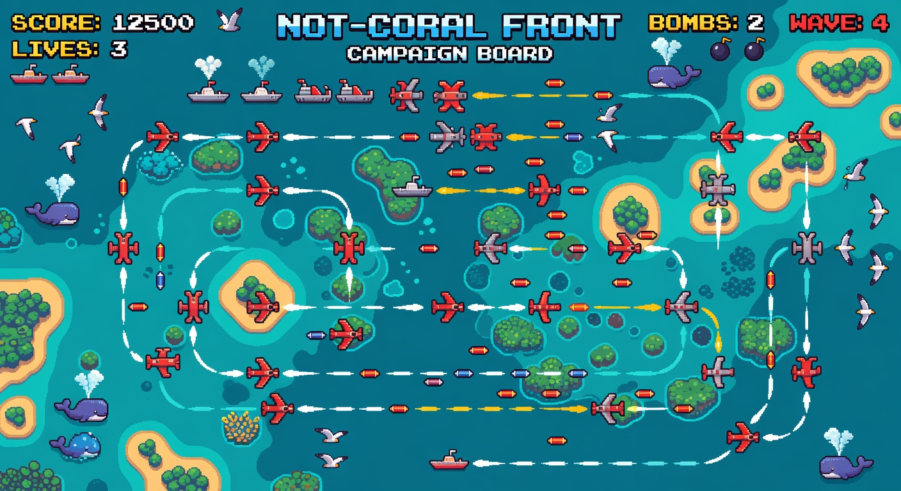
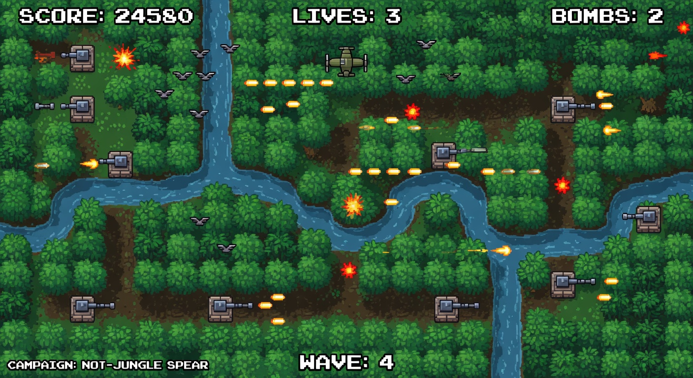
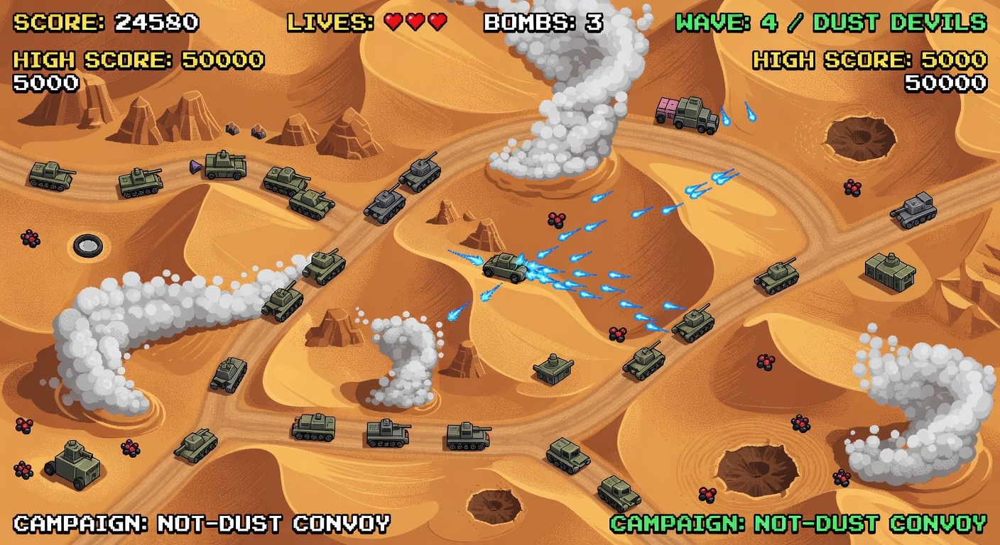
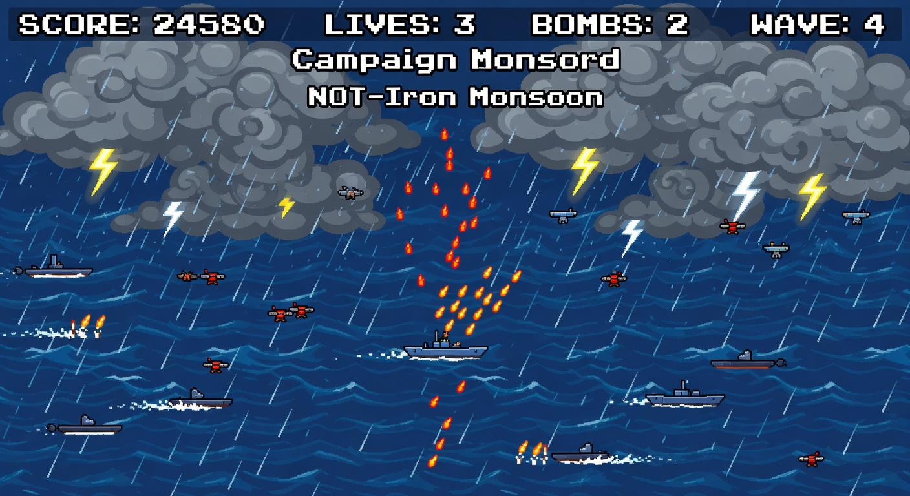

### Plane Roster and Roll Dodge
Plane focus for this phase:
- `XP-59 Specter` special: `Phase Shield`.
- `B7 Atlas` special: `EMP Wave`.

Roll dodge requirements:
- Sprite-driven roll sequence (not a single static tilt panel).
- Shared timing literacy and movement displacement.
- I-frame window shorter than the full roll animation.

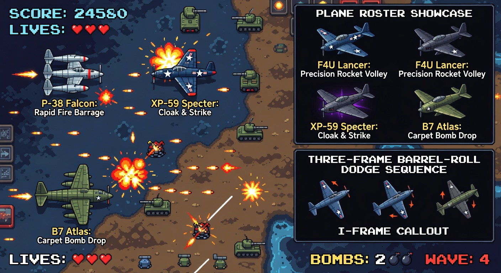
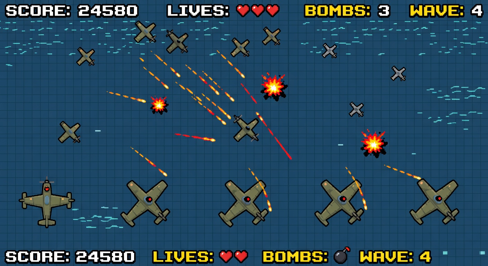

### Weapons and Upgrade Rules
Primary weapons:
- Base fire starts as single shot.
- Shot upgrade is progressive and stacks by tier: `Single -> Double -> Triple`.
- Speed boost modifies movement and evade spacing.

Special and utility:
- `Shield` does not stack.
- `Repair` does not stack.
- `Bomb Pack` stacks and powers board clear.
- `Passive Turret` pickup grants automated support fire.

Bomb clear behavior:
- Clears active enemy bullets.
- Deals heavy board-wide damage.
- Consumes one bomb stock.

### Enemy and Boss Visual Direction
Enemy classes:
- Small: fast injectors.
- Medium: pattern drivers.
- Large: anchor threats.
- Boss: screen-dominant multi-section threats.

Boss structure:
- Distinct destructible sections.
- Phase escalation by HP breakpoints.
- Increasing projectile complexity and lane pressure.

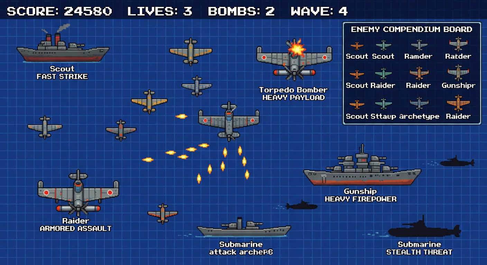
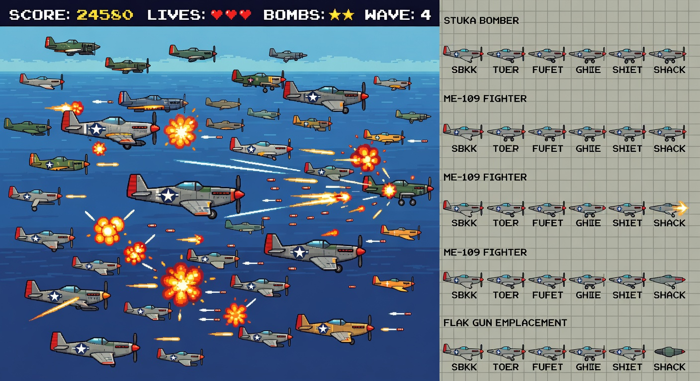
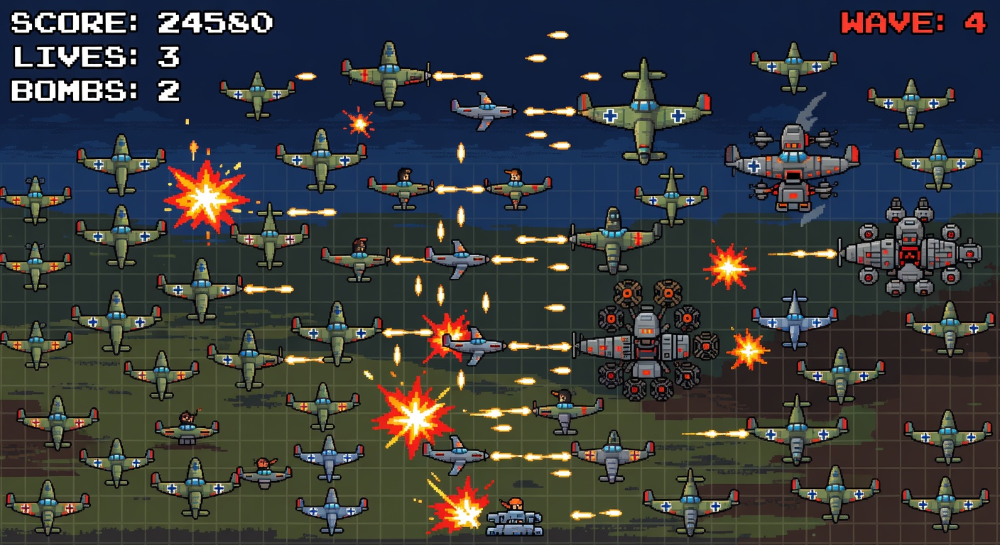

### Terrain and Ambient Wildlife
- Wildlife is non-interactive ambience only.
- Whales may surface and disappear as visual flavor.
- Seagulls are removed.

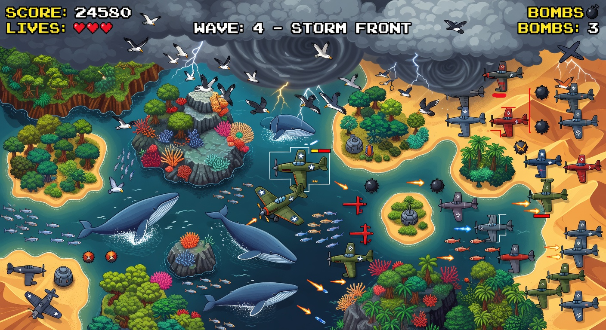

### Power-Ups and Readability
- All pickups use a consistent silhouette family.
- Drop readability is protected against terrain color noise.
- Late waves increase drop frequency through scaling multipliers.

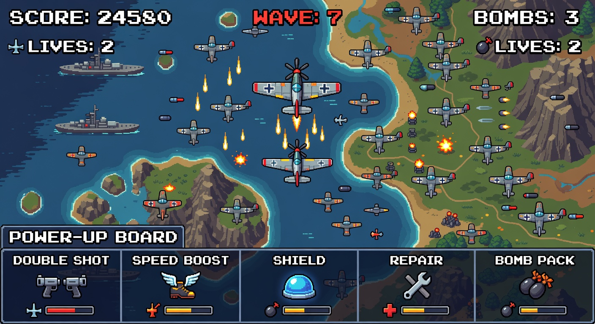

### Dialogue Style
Dialogue is comic-style high-contrast black/white with minimal accent color.

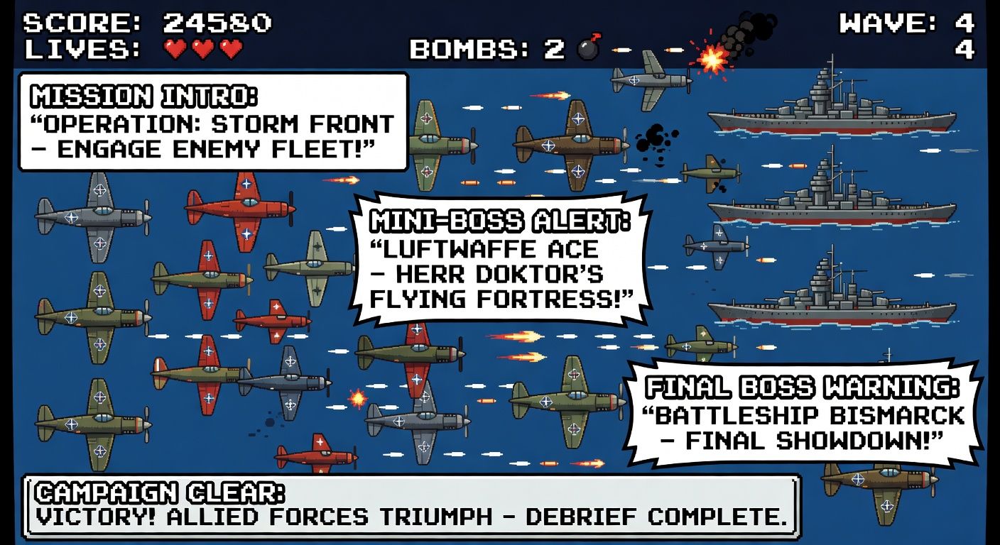

### Competitive Inspiration
- `1942`
- `Raiden`
- `Strikers 1945`
- `DoDonPachi`
- `Xevious`

Applied takeaways:
- Strong HUD clarity under bullet density.
- Top-down readability and silhouette control.
- Large, screen-filling bosses with phase identity.

## Round 5 Architecture Updates

### Tile Map System (ARCADE-073)
The game now uses a proper tile-based scrolling background system. Each campaign generates a full scrollable tile map.

**Architecture:**
- Tile size: 64px × 64px
- Map width: 15 tiles (960px)
- Map height: variable per campaign (120–200 rows)
- Generated procedurally from seeded RNG per campaign (consistent every playthrough)

**Three Parallax Layers:**

| Layer | Content | Scroll Speed | Purpose |
|---|---|---|---|
| Water (Layer 0) | Deep water, shallow water, dark water, foam | 0.2 px/frame | Ocean base — slow, creates depth |
| Terrain (Layer 1) | Islands, vegetation, sand, rock, structures | 0.5 px/frame | Land masses — medium, main gameplay layer |
| Clouds (Layer 2) | Thin clouds, thick clouds, storm clouds + sprite overlays | 2.0 px/frame | Atmospheric — fast, creates speed sensation |

**Tile Types per Layer:**

Water Layer:
- 0: Deep water
- 1: Shallow water
- 2: Dark water
- 3: Foam/surf

Terrain Layer:
- 0: Empty (transparent)
- 1: Sand/beach (island edges)
- 2: Grass/vegetation (island interior)
- 3: Rock (island center)
- 4: Structure (man-made)

Cloud Layer:
- 0: Empty
- 1: Thin cloud
- 2: Thick cloud
- 3: Storm cloud

**Campaign Map Lengths (ARCADE-075):**
| Campaign | Rows | Duration | Design Intent |
|---|---|---|---|
| Coral Front | 120 | Moderate | Tutorial — comfortable length |
| Jungle Spear | 150 | Long | More terrain variety before boss |
| Dust Convoy | 180 | Very Long | Endurance — relentless feel |
| Iron Monsoon | 200 | Longest | The gauntlet — maximum content |

### Map Layer Documentation (ARCADE-084)

Each tilemap has three logical layers plus enemy placement:

**Layer 1: Terrain**
- Procedurally generated islands using elliptical shapes with noise
- Island composition: sand edges → vegetation middle → rock/structure center
- Water channels create visual flow between islands
- Shore effects rendered around terrain edges

**Layer 2: Enemy Placement**
- Ground enemy slots generated on terrain and water tiles
- Bunkers placed on island terrain tiles (sand/vegetation)
- Ships placed on open water tiles
- Battleships placed in wider open water areas
- Each slot has type, position, and activation trigger

**Layer 3: Event Layer**
- Signature moments triggered at specific waves per campaign
- Campaign-specific scripted events (ambushes, wingmen, power-up showers)
- Boss warning phases at mini-boss and final boss waves
- Victory/debrief screens between campaigns

### Predefined Enemy Path System (ARCADE-071)

Enemies now follow smooth, deliberate flight paths — like slot cars on rails. No random jitter.

**Path Types:**

| Pattern | Description | Visual Character |
|---|---|---|
| `line` | Straight column descent | Clean, predictable |
| `vee` | V-formation with gentle breathing | Tight military formation |
| `formation` | Tight hold, minimal drift | Parade-like precision |
| `cross` | Smooth sine wave oscillation | Rhythmic left-right |
| `stagger` | Deliberate S-curve zigzag | Sharp, purposeful turns |
| `swirl` | Wide swooping arcs | Graceful, sweeping |
| `figure8` | Smooth infinity loop | Mesmerizing, looping |
| `dive` | Fast dive → pull-up arc | Aggressive, dramatic |
| `mini` | Slow menacing drift + figure-8 weave | Boss-like deliberation |
| `boss` | Player-tracking with slow weave | Intelligent, threatening |
| `ambush_left/right/bottom` | Smooth arc entries from edges | Surprise, flanking |

Each enemy gets a unique `pathPhase` offset for variety within formations while maintaining deliberate group motion.

**Progressive Side Entry (ARCADE-072):**
| Campaign | Side Entries | Rationale |
|---|---|---|
| C1: Coral Front | None — top only | Tutorial, don't overwhelm |
| C2: Jungle Spear | From W6 onward | Introduced with ambush event |
| C3: Dust Convoy | From W8 onward | Gradually escalating |
| C4: Iron Monsoon | All directions from start | Veterans only |

### Ground Enemy System (ARCADE-076/077/078/079)

New enemy class: ground/water enemies that are fixed to terrain tiles and scroll with the map.

**Bunkers (ARCADE-076):**
- Placed on island terrain tiles
- 15 HP, 70-frame fire rate
- Aimed single shots at player (orange bullets)
- Concrete visual with rotating gun slit

**Ships (ARCADE-077):**
- Placed on open water tiles
- Regular ships: 1 turret, 25 HP
- Battleships: 3 turrets with spread fire, 40 HP
- Yellow bullets, faster fire rate (55 frames)
- Visual includes hull, bow, turret bases, rotating barrels, wake foam

**Integration (ARCADE-078/079):**
- Position tied to terrain parallax scroll (0.5 px/frame)
- Activated when scrolling into view; despawned when off-screen
- Bomb deals 40% damage to ground targets
- 25% power-up drop chance on destruction
- HP bars and hit flash effects on damaged targets
- Score: Bunker 500, Ship 800, Battleship 1500

### Victory/Debrief System (ARCADE-080)

Between campaigns, a 6-second debrief screen shows:
- **MISSION COMPLETE** header with campaign name
- Stats: Score, Waves Cleared, Grazes, Lives, Bombs
- Story beat: brief narrative connecting campaigns
- Skippable with SPACE after 2 seconds

**Story Beats:**
1. "The Coral Front has fallen. Enemy forces retreat deeper into the Pacific..."
2. "Jungle Spear is neutralized. The enemy supply lines are cut..."
3. "The Dust Convoy is scattered. Only the Iron Monsoon remains..."
4. "The Iron Monsoon falls silent. You are a legend of the Pacific Theater."

### Enhanced Boss Warning (ARCADE-081)

Boss warning phase is now longer and more dramatic:
- Mini boss: 210 frames (3.5 seconds)
- Final boss: 300 frames (5 seconds)
- Progressive darkening effect
- Pulsing red bars at top/bottom of screen
- Growing WARNING/DANGER text
- Repeating alarm sound every 60 frames
- "BOSS APPROACHING" subtitle for final bosses

### Scripted Moments (ARCADE-083)

Each campaign now has multiple scripted events that surprise the player:

| Campaign | Wave | Event | Purpose |
|---|---|---|---|
| C1 | W7 | Power-up shower | Mid-act reward before harder enemies |
| C1 | W13 | Ambush all edges | First taste of multi-direction threat |
| C1 | W18 | Wingman | Allied support for final push |
| C2 | W6 | Ambush all edges | Signature surprise (existing) |
| C3 | W5 | Wingman | Early help against fast lancers |
| C3 | W10 | Power-up shower | Midpoint break (existing) |
| C3 | W15 | Ambush all edges | Late escalation |
| C4 | W3 | Power-up shower | Boost for the gauntlet |
| C4 | W7 | Ambush all edges | All-edge chaos |
| C4 | W11 | Wingman | Support before W12 boss |
| C4 | W14 | Wingman | Second wingman for endgame |
| C4 | W17 | Power-up shower | Final boost before climax |

### Plane Select Screen Updates (ARCADE-065/066/067/068/069)

- **Vibrant colors**: Full saturation backgrounds, brighter stars, richer card interiors
- **Contained text**: Stat labels abbreviated (SPD/FIRE/AGI → HI/MED/LO), fully within card bounds
- **Arrow key navigation**: Left/right arrows toggle between planes
- **Sprite display**: Uses actual image aspect ratio to avoid square stretching
- **No banking**: `getPlayerSpriteName()` always returns idle sprite — plane slides flat

### Power-Up Stacking (ARCADE-082 — Confirmed)

All timer-based power-ups stack by adding duration:
- `double-shot`: `+= 1800 frames` per pickup
- `speed-boost`: `+= 1500 frames` per pickup
- `shield`: `+= 1200 frames` per pickup
- `spread-shot`: `+= 1800 frames` per pickup
- `laser`: `+= 1800 frames` per pickup
- `homing`: `+= 1500 frames` per pickup

Non-timer pickups: Repair (+1 life, max 5), Bomb Pack (+2 bombs, max 5).

### Designer Research: Classic Vertical Shooter Analysis (ARCADE-085)

#### Enemy Shooting Mechanics (Across Classic Games)

**Turret Types:**
| Type | Behavior | Games | Application |
|---|---|---|---|
| Fixed forward | Always shoots straight down | 1942, Xevious | scout_zero base pattern |
| Aimed single | Targets player position | Raiden, Strikers 1945 | Bunkers, ships |
| Aimed burst | 3-5 round burst at player | DoDonPachi | gunship_hornet |
| Spread fan | 3-7 bullets in a fan | Raiden II, DoDonPachi | Boss phases |
| Rotating turret | Sweeps in arc, fires continuously | 1943, Strikers 1945 | Ship turrets |
| Tracking rounds | Bullets curve toward player | DoDonPachi, ESP Ra.De | storm_wraith |
| Pulse ring | Expanding circle of bullets | DoDonPachi, Mushihimesama | Boss phase 3+ |
| Lane denial | Sustained fire blocking corridors | Raiden, 1942 | rail_bomber |

**Ship Types with Multi-Turret Layouts:**
| Ship Class | Turrets | Behavior | Reference |
|---|---|---|---|
| Patrol boat | 1 turret | Aimed shots | 1943 |
| Destroyer | 2 turrets (fore/aft) | Alternating aimed fire | Strikers 1945 |
| Battleship | 3 turrets (fore/mid/aft) | Spread + aimed combo | 1943, Raiden |
| Carrier | Flight deck + AA | Launches fighters + AA fire | Strikers 1945 |

#### Movement Patterns from Classic Games

**1942/1943 (Okamoto):**
- Enemies enter in tight V-formations from top
- Break formation after reaching mid-screen
- Dive-bombing runs: fast diagonal approach
- Looping: enemies fly past, loop back for second pass

**Xevious (Ground Target Pioneer):**
- Ground targets NEVER move — fixed positions
- Rotating turrets track player smoothly
- Different ground types: bunkers, cannons, tanks, radar dishes
- Player must use bombs for ground targets, bullets for air

**Raiden/Raiden II:**
- Tanks roll in from sides on ground layer
- Ships approach from top, park at fixed Y positions
- Boss turrets have independent rotation rates
- "Turret priority targeting" — closest turret fires most

**Strikers 1945:**
- Formations hold shape longer before breaking
- Some enemies orbit a central point
- Ground vehicles follow road paths (like tile-based rails)
- Multi-phase boss transformations

**DoDonPachi/CAVE (Ikeda):**
- Dense bullet patterns with safe channels
- Enemy movement is secondary to bullet art
- Turrets fire in precise geometric patterns
- Boss attacks are choreographed sequences

#### Ground Enemy Design (From Research)

**Bunker Types:**
| Type | Fire Pattern | HP | Notes |
|---|---|---|---|
| MG Bunker | Rapid aimed burst | Low | Fast but weak — early levels |
| AA Emplacement | Spread fan upward | Medium | Anti-air specialist |
| Missile Silo | Slow homing rockets | High | Dangerous but rare |
| Radar Station | No direct fire, buffs nearby | Low | Destroy to reduce enemy accuracy |

**Naval Vessel Types:**
| Type | Turrets | Special | Notes |
|---|---|---|---|
| Patrol Boat | 1 | Fast movement | Scrolls faster than terrain |
| Destroyer | 2 | Torpedo launch | Forward torpedoes in addition to turrets |
| Battleship | 3 | Heavy armor | Takes many hits, high score reward |
| Carrier | 0 direct | Spawns fighters | Destroying stops fighter waves |

#### What Made Classic Levels Memorable

**Miyamoto Lens — Teach Through Play:**
- Level 1 introduces ONE enemy type, ONE attack pattern
- New mechanics introduced in safe contexts first
- The environment itself teaches (narrow channels force dodging practice)
- Power-ups placed to reward exploration of movement

**Kojima Lens — Narrative Motivation:**
- Each campaign should feel like a chapter with rising action
- Debrief screens create emotional beats between campaigns
- Radio chatter during gameplay creates narrative presence
- The wingman moment creates emotional bond/stakes

**Ikeda Lens — Skill Ceiling:**
- Graze system rewards aggressive positioning
- Chain combo system rewards consistent engagement
- Perfect wave bonus rewards mastery
- Multiple enemy firing patterns create reading challenges
- Bullet density should scale with player skill indicators

**Okamoto Lens — Arcade Feel:**
- Immediate readability: player always knows what's dangerous
- Pacing: tension → release → tension cycles
- "One more try" hooks: score milestones, chain records
- Sound design reinforces every interaction
- Power-ups feel transformative, not incremental

## Mechanics

### Campaign and Wave Cadence
- Campaign count: 4.
- Waves per campaign: 20.

| Wave Range | Role |
|---|---|
| `1-4` | onboarding and clean lanes |
| `5` | mini boss 1 |
| `6-9` | mixed pressure |
| `10` | mini boss 2 |
| `11-14` | terrain + pressure blend |
| `15` | mini boss 3 |
| `16-19` | high-density pressure |
| `20` | final boss |

### Enemy Types and Projectile Families
| Family | Movement | Primary Fire | Secondary Fire | Role |
|---|---|---|---|---|
| `scout_zero` | quick dive lanes | narrow burst | snap aimed shot | early pressure |
| `torpedo_gull` | low sweep | low arc spread | lane bomb drop | low-alt disruption |
| `canopy_raider` | flank weave | angled crossfire | side pincer burst | flank opener |
| `gunship_hornet` | slow anchor drift | sustained stream | delayed bloom burst | zone denial |
| `dune_lancer` | high-speed line dash | straight lance shot | dash tracer line | intercept |
| `rail_bomber` | staggered lane hold | heavy volley | rear mine trail | attrition |
| `storm_wraith` | pulse oscillation | pulse ring | tracking drift rounds | visibility stress |
| `sub_spear` | surfacing pop-in | torpedo fan | wake mines | low-lane control |

### Boss Phase Model
Each final boss has four core sections: `port battery`, `starboard battery`, `engine`, `core`.

1. `Phase 1`: spread baseline and movement literacy.
2. `Phase 2`: aimed bursts + crossfire.
3. `Phase 3`: tracking rounds + lane denial.
4. `Phase 4`: combined patterns with short recovery windows.

### Campaign-by-Campaign Progression
#### Campaign 1: NOT-Coral Front
- Intro: `scout_zero`.
- Added pressure: `torpedo_gull`.
- Mini bosses: `reef_guardian` on W5/W10/W15.
- Final boss: `coral_dreadnought` on W20.
- Terrain: reefs + island channels + ambient whales.

#### Campaign 2: NOT-Jungle Spear
- Intro: `canopy_raider`.
- Added pressure: `gunship_hornet`.
- Legacy remix: `scout_zero` ambush packs.
- Mini bosses: `river_bastion` on W5/W10/W15.
- Final boss: `jungle_citadel` on W20.

#### Campaign 3: NOT-Dust Convoy
- Intro: `dune_lancer`.
- Added pressure: `rail_bomber`.
- Legacy remix: `gunship_hornet` overlay waves.
- Mini bosses: `convoy_ram` on W5/W10/W15.
- Final boss: `dust_colossus` on W20.

#### Campaign 4: NOT-Iron Monsoon
- Intro: `storm_wraith`.
- Added pressure: `sub_spear`.
- Legacy remix: `dune_lancer` + `canopy_raider` late waves.
- Mini bosses: `monsoon_blade` on W5/W10/W15.
- Final boss: `iron_tempest` on W20.

### Upgrade Drop Scaling
| Context | Base Chance | Progression Multiplier | Guaranteed |
|---|---|---|---|
| Small enemy | 10% | +0.4% per wave after W8 | No |
| Medium enemy | 14% | +0.5% per wave after W8 | No |
| Large enemy | 20% | +0.7% per wave after W8 | No |
| Mini boss | 100% | n/a | Yes |
| Final boss | 100% major drop | n/a | Yes |

## Wave-by-Wave Visual Review
Each wave preview is generated to match vertical-shooter composition, top HUD layout, and campaign-specific readability constraints.

### Campaign 1: NOT-Coral Front
#### C1 Wave 1

#### C1 Wave 2

#### C1 Wave 3

#### C1 Wave 4

#### C1 Wave 5

#### C1 Wave 6

#### C1 Wave 7

#### C1 Wave 8

#### C1 Wave 9

#### C1 Wave 10

#### C1 Wave 11

#### C1 Wave 12

#### C1 Wave 13

#### C1 Wave 14

#### C1 Wave 15

#### C1 Wave 16

#### C1 Wave 17

#### C1 Wave 18

#### C1 Wave 19

#### C1 Wave 20

### Campaign 2: NOT-Jungle Spear
#### C2 Wave 1

#### C2 Wave 2

#### C2 Wave 3

#### C2 Wave 4

#### C2 Wave 5

#### C2 Wave 6

#### C2 Wave 7

#### C2 Wave 8

#### C2 Wave 9

#### C2 Wave 10

#### C2 Wave 11

#### C2 Wave 12

#### C2 Wave 13

#### C2 Wave 14

#### C2 Wave 15

#### C2 Wave 16

#### C2 Wave 17

#### C2 Wave 18

#### C2 Wave 19

#### C2 Wave 20

### Campaign 3: NOT-Dust Convoy
#### C3 Wave 1

#### C3 Wave 2

#### C3 Wave 3

#### C3 Wave 4

#### C3 Wave 5

#### C3 Wave 6

#### C3 Wave 7

#### C3 Wave 8

#### C3 Wave 9

#### C3 Wave 10

#### C3 Wave 11

#### C3 Wave 12

#### C3 Wave 13

#### C3 Wave 14

#### C3 Wave 15

#### C3 Wave 16

#### C3 Wave 17

#### C3 Wave 18

#### C3 Wave 19

#### C3 Wave 20

### Campaign 4: NOT-Iron Monsoon
#### C4 Wave 1

#### C4 Wave 2

#### C4 Wave 3

#### C4 Wave 4

#### C4 Wave 5

#### C4 Wave 6

#### C4 Wave 7

#### C4 Wave 8

#### C4 Wave 9

#### C4 Wave 10

#### C4 Wave 11

#### C4 Wave 12

#### C4 Wave 13

#### C4 Wave 14

#### C4 Wave 15

#### C4 Wave 16

#### C4 Wave 17

#### C4 Wave 18

#### C4 Wave 19

#### C4 Wave 20

## Asset Gallery
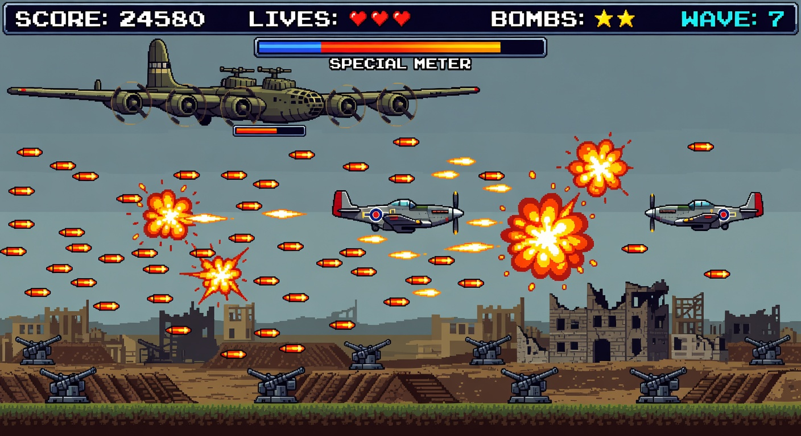

## AI Art Pipeline
- Source model: `grok-imagine-image`.
- Art script: `scripts/generate-1942-art.mjs`.
- Extraction script: `scripts/extract-1942-sprites.mjs`.
- Output folder: `1942/design/assets/highfi/`.
- Manifest: `1942/design/assets/highfi/art-manifest.json`.
- Extraction manifest: `1942/design/assets/highfi/extracted/extract-manifest.json`.

Expected generated assets:
- 4 campaign boards.
- 80 wave previews.
- Plane sheet (Specter + Atlas).
- Player roll sprite sheet.
- Enemy compendium and enemy sprite sheet.
- Boss sprite sheet and boss behavior board.
- Power-up board with progressive shot tiers and passive turret.
- Terrain board and whale ambient strip.
- Dialogue comic board.

## Implementation Checklist
- [x] Single canonical markdown source.
- [x] Unified HTML render target.
- [x] Top-down/vertical composition constraints in generator prompts.
- [x] Two-plane focus (`Specter`, `Atlas`).
- [x] 80-wave visual review section.
- [x] Sprite extraction pipeline and metadata.
- [x] Updated upgrade/drop mechanics documented.
