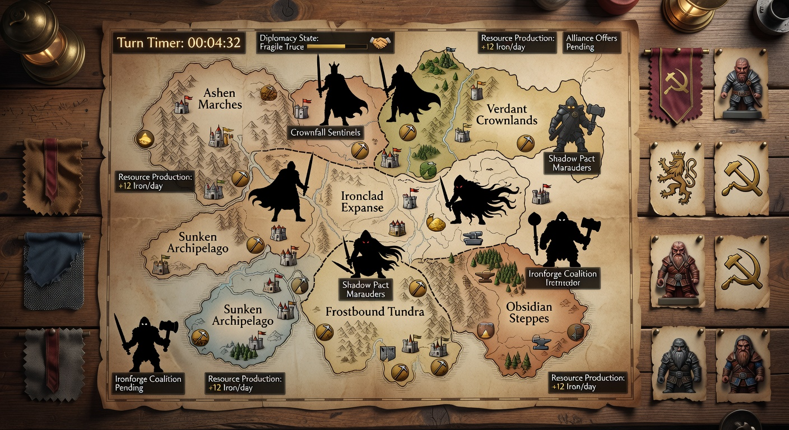
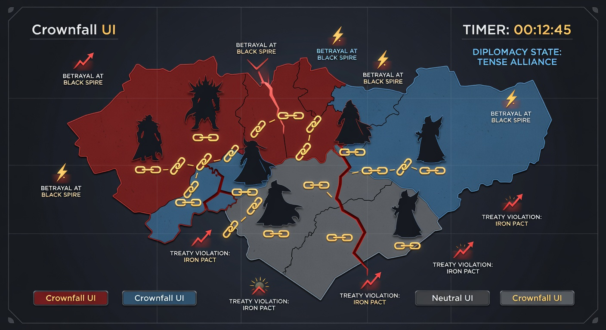
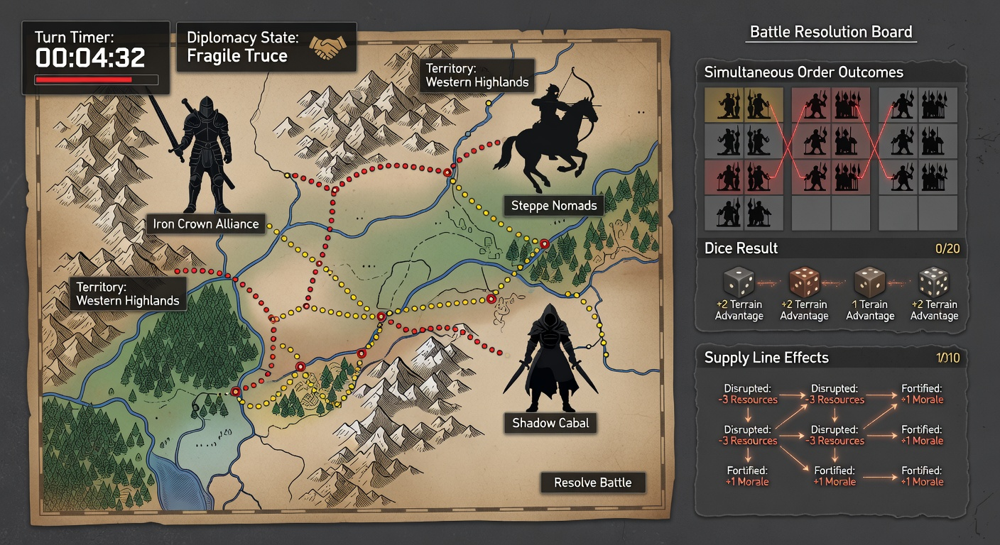
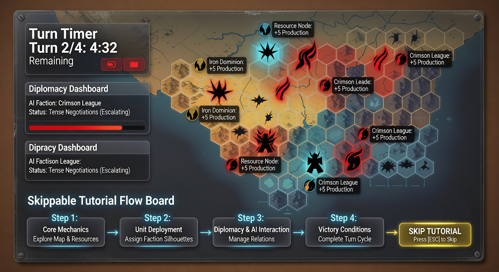
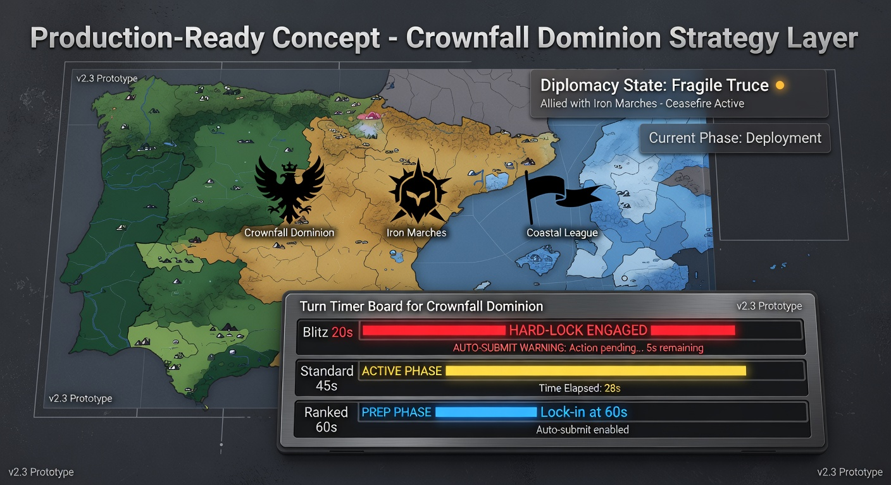
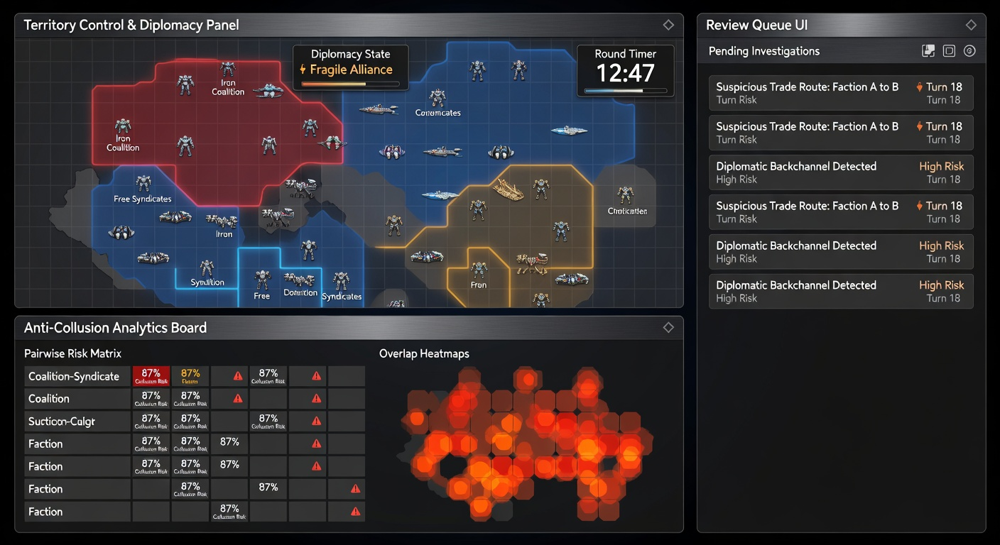

# Crownfall Dominion Unified Design Book

## Quick Navigation
- [Vision](#vision)
- [Build Surfaces](#build-surfaces)
- [Rules and Turn Structure](#rules-and-turn-structure)
- [Time Lock and Match Pacing](#time-lock-and-match-pacing)
- [Tutorial Onboarding (Skippable)](#tutorial-onboarding-skippable)
- [Map, Factions, and Diplomacy](#map-factions-and-diplomacy)
- [World Events Engine](#world-events-engine)
- [Multiplayer, Determinism, and Anti-Collusion](#multiplayer-determinism-and-anti-collusion)
- [UI and Screen Contracts](#ui-and-screen-contracts)
- [Telemetry and Enforcement](#telemetry-and-enforcement)
- [Concept Art Pack](#concept-art-pack)
- [Data Interfaces](#data-interfaces)
- [Math and Technique References](#math-and-technique-references)
- [Acceptance Scenarios](#acceptance-scenarios)
- [Production Checklist](#production-checklist)

## Vision
`Crownfall Dominion` is a turn-based conquest strategy game focused on fast, time-locked turns, meaningful diplomacy, and deterministic ranked integrity.

Session targets:
- blitz: 18-25 minutes,
- standard live: 30-45 minutes,
- async: long-form social play.

## Build Surfaces
Client modules:
- territory map renderer,
- order planner,
- diplomacy panel,
- turn timer UX,
- replay viewer,
- tutorial flow.

Server modules:
- authoritative turn resolver,
- deterministic event scheduler,
- ranked/MMR service,
- anti-collusion scorer and review queue.

## Rules and Turn Structure
Turn sequence:
1. reinforcement,
2. diplomacy,
3. order assignment,
4. simultaneous resolution,
5. world event application.

Combat:
- attack dice up to 3,
- defense dice up to 2,
- tie favors defense,
- supply penalties for disconnected fronts.

Victory:
- control `65%` of territories, or
- hold all enemy capitals for 2 turns.

## Time Lock and Match Pacing
| Mode | Turn Timer | Timeout Action |
|---|---:|---|
| Blitz | 20s | auto-submit queued orders |
| Standard Live | 45s | auto-submit queued orders |
| Ranked Live | 60s | auto-submit queued orders |
| Async 12h | 12h | auto-pass if expired |
| Async 24h | 24h | auto-pass if expired |

Hard rules:
- ranked live has no timer extensions,
- unresolved pacts expire at lock,
- warning states at T-10 and T-5.

## Tutorial Onboarding (Skippable)
Four-turn guided tutorial vs AI:
1. reinforce two borders,
2. send one diplomacy offer,
3. queue attack + fortify,
4. resolve one world event.

Skip rules:
- skip at entry,
- skip after each turn milestone,
- replay from settings.

Completion flag unlocks default live queue access.

## Map, Factions, and Diplomacy
World map:
- 28 territories,
- 6 regions with asymmetric bonuses,
- capitals provide morale and reinforcement multiplier.

Faction archetypes:
- Iron Court (defensive),
- Sun Pact (diplomatic),
- Ash Legion (aggressive),
- Tide Union (mobility).

Diplomacy:
- pact types: truce/alliance/warning,
- public and private variants,
- betrayal cooldown and trust penalties.

## World Events Engine
Determinism rule:
- event selection = function(seed, turn, current_state_hash).

Event categories:
- border revolt,
- famine tax,
- mercenary uprising,
- supply collapse,
- twin catastrophe.

Each event defines:
- trigger window,
- affected regions,
- numeric modifiers,
- duration,
- UI warning strings.

## Multiplayer, Determinism, and Anti-Collusion
Modes:
- solo vs AI,
- live PvP (2-6),
- async PvP.

Deterministic replay:
- canonical order log + outcome hash each turn,
- server-only randomness with seed derivation.

Anti-collusion pipeline:
- feature extraction per player pair:
  - target overlap,
  - non-aggression outlier,
  - treaty benefit imbalance,
  - surrender timing anomalies.
- scoring:
  - z-score normalized features,
  - weighted risk composite,
  - risk band low/medium/high.
- enforcement:
  - low: monitor,
  - medium: review queue,
  - high: invalidate ranked result + queue restriction path.

## UI and Screen Contracts
Required screens:
- main menu,
- mode select,
- tutorial setup,
- live turn board,
- diplomacy modal,
- event recap,
- match recap,
- replay viewer,
- async notification inbox,
- ranked integrity notice state.

Critical HUD elements:
- turn timer,
- reinforcement pool,
- active pacts and expiry,
- event indicator,
- trust/reputation delta.

## Telemetry and Enforcement
Core telemetry events:
- order queued/removed,
- pact sent/accepted/rejected/broken,
- timeout auto-submit/pass,
- event applied,
- match result,
- anti-collusion features and risk score,
- enforcement action emission.

Ranked enforcement audit log retains:
- source match ids,
- pair ids,
- feature vector snapshot,
- decision trace.

## Concept Art Pack








## Data Interfaces
```ts
interface MatchConfig {
  mode: 'solo' | 'live' | 'async';
  map_id: string;
  max_players: number;
  world_events: boolean;
  timer_profile: 'blitz' | 'standard_live' | 'ranked_live' | 'async_12h' | 'async_24h';
}

interface TurnTimerConfig {
  turn_timer_sec: number;
  timeout_policy: 'auto_submit' | 'auto_pass';
}

interface TutorialState {
  enabled: boolean;
  step: 0 | 1 | 2 | 3 | 4;
  skippable: boolean;
  completed: boolean;
}

interface DiplomacyState {
  from_player: string;
  to_player: string;
  pact_type: 'truce' | 'alliance' | 'warning';
  expires_turn: number;
  public: boolean;
}

interface OrderResolution {
  turn: number;
  orders: Array<{ player_id: string; kind: 'attack' | 'fortify' | 'reserve'; source: string; target?: string }>;
  outcome_hash: string;
}

interface CollusionSignal {
  pair_id: string;
  jaccard_target_overlap: number;
  non_aggression_outlier_z: number;
  treaty_imbalance_z: number;
  surrender_timing_z: number;
}

interface CollusionRiskScore {
  pair_id: string;
  risk: number;
  band: 'low' | 'medium' | 'high';
}

interface EnforcementAction {
  match_id: string;
  action: 'none' | 'review_queue' | 'invalidate_ranked_result' | 'queue_restrict';
}
```

## Math and Technique References
- Elo rating system: https://en.wikipedia.org/wiki/Elo_rating_system
- Glicko rating system: https://en.wikipedia.org/wiki/Glicko_rating_system
- Jaccard index: https://en.wikipedia.org/wiki/Jaccard_index
- Standard score (z-score): https://en.wikipedia.org/wiki/Standard_score

## Acceptance Scenarios
1. Timer expiry performs correct auto-submit/auto-pass by mode.
2. Tutorial is skippable and replayable without progression corruption.
3. Replay determinism reproduces outcomes from log + seed.
4. Anti-collusion detector emits risk bands for synthetic test patterns.
5. Ranked invalidation prevents MMR update on high-risk matches.
6. Async deadlines generate reminders and expiration behavior correctly.

## Production Checklist
- [ ] map/faction asset pipeline
- [ ] timer UX and lock state implementation
- [ ] tutorial scripting and AI coach behavior
- [ ] deterministic turn resolver and replay hash validation
- [ ] anti-collusion scoring service and review queue UI
- [ ] ranked enforcement logging and audit tools
