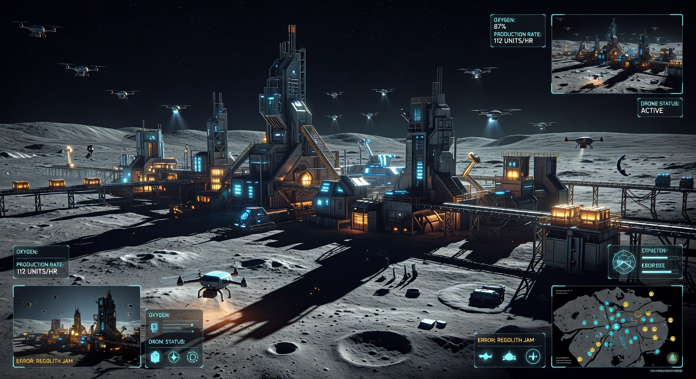
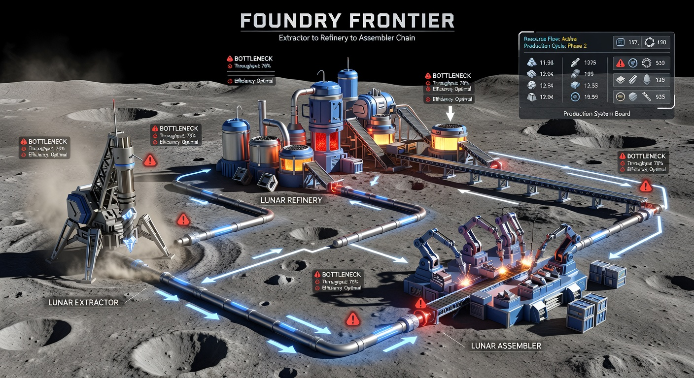
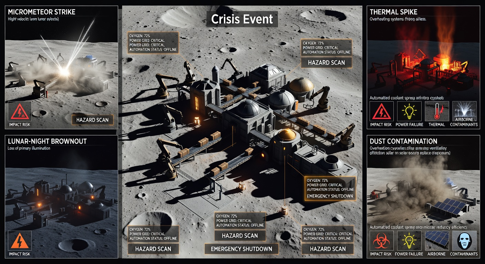
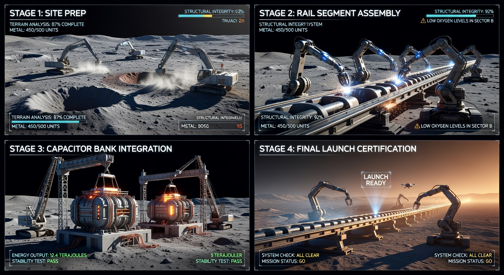
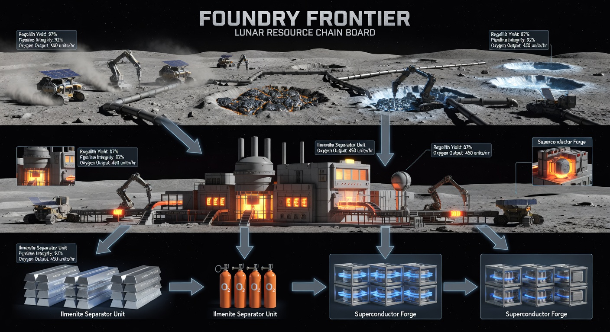
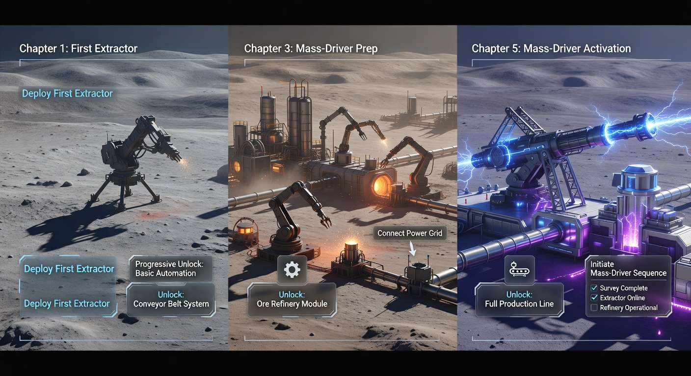

# Foundry Frontier Unified Design Book

## Quick Navigation
- [Vision](#vision)
- [Build Surfaces](#build-surfaces)
- [Core Loop and State Machines](#core-loop-and-state-machines)
- [Starting State and Tutorial Flow](#starting-state-and-tutorial-flow)
- [Machine and Recipe Catalog](#machine-and-recipe-catalog)
- [Mass Driver Program Stages](#mass-driver-program-stages)
- [Unlock and Progression Rules](#unlock-and-progression-rules)
- [Multiplayer and Matchmaking](#multiplayer-and-matchmaking)
- [UI and Screen Contracts](#ui-and-screen-contracts)
- [Failure Modes and Recovery](#failure-modes-and-recovery)
- [Telemetry and Replay](#telemetry-and-replay)
- [Concept Art Pack](#concept-art-pack)
- [Data Interfaces](#data-interfaces)
- [Acceptance Scenarios](#acceptance-scenarios)
- [Production Checklist](#production-checklist)

## Vision
`Foundry Frontier` is a lunar automation strategy game where the victory condition is completing and certifying a moon mass driver. The design goal is factory optimization plus crisis recovery under constrained oxygen, power, and heat budgets.

Player fantasy:
- start from a fragile outpost,
- scale into a high-throughput industrial moon base,
- launch the mass driver payload.

Session targets:
- quick run: 20 minutes,
- standard campaign run: 45-70 minutes.

## Build Surfaces
Client modules:
- world sim renderer,
- build/placement tools,
- logistics overlay,
- objective and unlock HUD,
- crisis alert panel,
- post-run summary.

Server modules:
- deterministic tick authority,
- co-op sync and checksum validator,
- matchmaking queue (single global),
- replay event writer.

Data services:
- progression profile,
- unlock state,
- telemetry ingest.

## Core Loop and State Machines
Loop:
1. extract lunar resources,
2. refine into industrial feedstock,
3. assemble mass-driver components,
4. stabilize during crisis events,
5. advance stage requirements.

Match lifecycle state machine:
- `init -> onboarding -> live -> stage_checkpoint -> live -> certification -> complete|failed`

Certification state machine:
- `prep -> charge -> sustain_window -> validation -> pass|fail`

## Starting State and Tutorial Flow
Starting state contract:
- extractor: 1,
- refinery: 1,
- belt tiles: 6,
- micro battery: 1,
- hab core: 1,
- starter resources: low oxygen reserve, 150 power cells.

First-20-minute tutorial chapters:
1. first dust (mine and route),
2. breath and power (oxygen and grid stability),
3. flow discipline (split/merge priority),
4. stage prep (first mass-driver chain).

Tutorial rules:
- max two new concepts per chapter,
- chapter objective plus optional mastery objective,
- skip available after chapter 1.

## Machine and Recipe Catalog
### Machine Specs
| Machine ID | Role | Tick (ms) | Power Draw | Heat |
|---|---|---:|---:|---:|
| `extractor_t1` | regolith extraction | 1000 | 6 | 1 |
| `separator_ilmenite_t1` | ilmenite separation | 1400 | 8 | 2 |
| `electrolysis_t1` | oxygen/hydrogen split | 1800 | 12 | 3 |
| `smelter_al_t2` | aluminum feedstock | 1600 | 11 | 3 |
| `assembler_precision_t2` | advanced components | 2200 | 14 | 4 |
| `foundry_rail_t3` | rail segments | 2800 | 18 | 6 |
| `forge_capacitor_t3` | capacitor cores | 3000 | 20 | 7 |

### Core Recipes
| Recipe ID | Inputs | Outputs | Time (ms) |
|---|---|---|---:|
| `r_regolith_to_feed` | regolith x4 | feedstock x2 | 1200 |
| `r_ilmenite_to_al` | ilmenite x3 + power x2 | aluminum_feed x2 + oxygen_trace x1 | 1800 |
| `r_ice_to_o2_h2` | polar_ice x2 + power x3 | oxygen x3 + hydrogen x2 | 2000 |
| `r_composite_shell` | aluminum_feed x2 + basalt_glass x1 | composite_shell x1 | 2400 |
| `r_supercoil` | aluminum_feed x2 + hydrogen x1 + rare_dust x1 | supercoil x1 | 2600 |
| `r_rail_segment` | composite_shell x2 + supercoil x1 | rail_segment x1 | 3200 |
| `r_capacitor_core` | supercoil x2 + ceramic x1 | capacitor_core x1 | 3400 |

## Mass Driver Program Stages
| Stage | Required Deliverables | Stability Requirement |
|---|---|---|
| 1 Site Prep | 120 feedstock, 60 oxygen | uptime >= 90% for 180s |
| 2 Materials | 90 aluminum feed, 40 ceramic, 40 hydrogen | thermal margin >= 15 |
| 3 Accelerator Build | 24 rail segments, 18 capacitor cores, 10 guidance modules | power reserve >= 25% |
| 4 Launch Cert | sustain target throughput for 300s | no critical faults during window |

Win condition:
- pass stage 4 launch certification.

Fail conditions:
- oxygen zero for > 30s,
- thermal runaway > threshold for > 20s,
- debt state active for > 180s.

## Unlock and Progression Rules
Unlock currencies:
- `tech_points` (chapter + efficiency rewards),
- `safety_tier` (gates high-energy systems),
- `discovery_flags` (resource-chain first completion).

Unlock table:
| Unlock | Requirement | Cost |
|---|---|---:|
| Splitter/Merger | chapter 2 clear | 2 tech points |
| Drone Relay | chapter 3 clear | 4 tech points |
| Rail Foundry | safety tier 2 | 5 tech points |
| Capacitor Forge | safety tier 3 + supercoil chain | 6 tech points |
| Launch Control Node | stage 3 start | 8 tech points |

Progression guardrails:
- no more than two mandatory new systems per chapter,
- hard prereq checks before stage promotion.

## Multiplayer and Matchmaking
Modes:
- solo campaign,
- co-op program (2-4 players),
- versus race.

Queue model:
- one global queue for v1,
- party queue enabled,
- no region partition in v1.

Determinism:
- lockstep tick authority,
- checksum every 5s,
- desync auto-pause + rollback window (3s).

Reconnect:
- 60s grace window,
- bot fallback after 20s disconnect.

## UI and Screen Contracts
Required screens:
- main menu,
- mode select,
- queue/lobby,
- tutorial chapter panel,
- in-match HUD,
- logistics debug overlay,
- unlock modal,
- crisis alert screen,
- stage checkpoint summary,
- run-end result screen.

HUD required widgets:
- oxygen, power, thermal margin,
- stage progress,
- throughput graph,
- active crisis badge,
- objectives list.

## Failure Modes and Recovery
- `oxygen_deficit`: disable non-critical production, highlight oxygen chain.
- `power_brownout`: auto-throttle high-draw machines.
- `thermal_spike`: force vent and cooling priority mode.
- `desync_detected`: pause, reconcile, and resume or fail-safe end.

Recovery rules are explicitly surfaced with recommended next action text.

## Telemetry and Replay
Core events:
- placement/edit/remove machine,
- recipe start/finish,
- unlock granted,
- crisis enter/exit,
- stage checkpoint pass/fail,
- certification pass/fail,
- reconnect/desync events.

Replay model:
- deterministic state snapshots each 5s,
- event log with seed and tick alignment.

## Concept Art Pack








## Data Interfaces
```ts
interface MatchConfig {
  mode: 'solo' | 'coop' | 'versus';
  map_seed: number;
  difficulty: 'normal' | 'hard' | 'insane';
  queue: 'global';
  max_players: number;
}

interface ProductionGraph {
  nodes: Array<{ id: string; type: string; recipe?: string }>;
  edges: Array<{ from: string; to: string; lane: number }>;
}

interface UnlockState {
  tech_points: number;
  safety_tier: 0 | 1 | 2 | 3 | 4;
  unlocked_machines: string[];
  unlocked_resources: string[];
  unlocked_mass_driver_stage: 0 | 1 | 2 | 3 | 4;
}

interface MassDriverProgramState {
  stage: 0 | 1 | 2 | 3 | 4;
  rail_segments_built: number;
  capacitor_stability: number;
  thermal_margin: number;
  certification_ready: boolean;
}

interface PlayerInputEvent {
  timestamp_ms: number;
  action: 'place' | 'rotate' | 'connect' | 'upgrade' | 'pause' | 'set_priority';
  target_id?: string;
  payload?: Record<string, string | number | boolean>;
}
```

## Acceptance Scenarios
1. New player reaches stage 1 clear in <= 12 minutes.
2. Tutorial introduces <= 2 new systems per chapter.
3. Stage gates block invalid progression states.
4. Global queue enters co-op match and handles reconnect.
5. Replay can reproduce certification result from seed + log.
6. All HUD critical stats remain visible during crisis events.

## Production Checklist
- [ ] machine prefabs and recipe runtime integration
- [ ] stage state machine and certification validator
- [ ] tutorial scripting and objective gating
- [ ] crisis event implementations and balancing pass
- [ ] lobby/queue/reconnect flows
- [ ] telemetry schema integration
- [ ] deterministic replay verification
